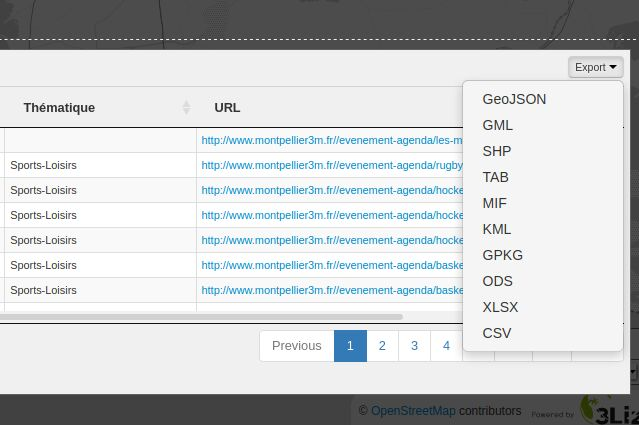

# wfsOutputExtension


[](https://plugins.qgis.org/plugins/wfsOutputExtension/)
[](https://github.com/3liz/qgis-wfsOutputExtension/actions?query=branch%3Amaster)

QGIS Server Plugin to add additional output formats to WFS GetFeature request.

Demo in [Lizmap Web Client](https://github.com/3liz/lizmap-web-client): 



## Description

wfsOutputExtension is a QGIS Server Plugin. It extends OGC Web Feature Service capabilities.
It adds output formats to WFS GetFeature request.

It adds:
* CSV
* ESRI ShapeFile as ZIP file
* Geopackage
* GPX
* KML
* MapInfo TAB as ZIP file
* MIF/MID File as ZIP file
* ODS, the datatable
* XLSX, the datatable

## Installation

We recommend to use [QGIS-Plugin-Manager](https://pypi.org/project/qgis-plugin-manager/) :

```commandline
# After you have installed and setup qgis-plugin-manager
cd /opt/qgis/plugins
qgis-plugin-manager install wfsOutputExtension
# Check rights
# Restart QGIS Server
```

For more details :

* Read [the documentation of QGIS Server](https://docs.qgis.org/testing/en/docs/server_manual/plugins.html#installation).
* Read [AtlasPrint install process](https://github.com/3liz/qgis-atlasprint/blob/master/atlasprint/README.md#installation-with-qgis-server)
  because it's similar.

## Debug on production

It's possible to set `DEBUG_WFSOUTPUTEXTENSION` to `TRUE` or `1`, the plugin will not remove temporary files on the disk.

## Tests

Using the docker stack to test the plugin :

```bash
docker pull 3liz/qgis-platform:3.16
docker tag 3liz/qgis-platform:3.16 qgis-platform:3.16
make test
```
